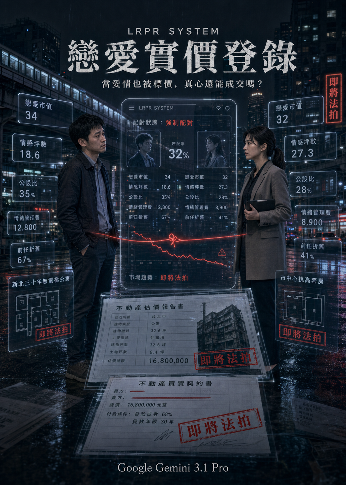

# 《戀愛實價登錄》

在這個版本的台灣，戀愛不再從心動開始，而是從一份估價報告開始。每一次右滑、每一句晚安、每一場家族飯局，都會被系統換算成市值、坪數與信用風險。有人靠條件增值，有人因年齡折舊，有人明明只是想被好好理解，卻先被迫證明自己值得成交。《戀愛實價登錄》就是從這塊冷冰冰的看板揭幕：當愛被公開標價，人還能不能保留一點不划算的真心？這份設定集，是故事開盤前的行情說明，也是所有荒謬交易的第一張合約。

## 一、小說核心設定

這是一部帶有輕微魔幻現實色彩的台灣都市諷刺小說。在故事設定的近未來台灣，婚戀市場被高度數據化與體制化，政府與財團聯手推出了「戀愛實價登錄」系統（簡稱 LRPR）。所有單身男女的學歷、薪資、房產、外貌甚至前任數量，都會經過演算法換算成「戀愛市值」與「坪數」，並隨時在市場上公開波動。

愛情不再是盲目的，而是完全透明的房地產交易。條件好的人是「蛋黃區豪宅」，條件差的是「蛋白區老頂加」；追求者必須支付「頭期款」與「情緒管理費」。故事不寫俗套的兩性對立，而是透過男主角林祐誠在「被估價」與「找買家」的過程中，探討現代人如何在資本邏輯、家庭催婚與交友軟體的夾擊下，逐漸失去愛人的能力，並試圖在荒謬的標價牌背後，找回一絲無價的真心。

## 二、主要角色表

| 角色 | 年齡 | 職業 | 外在目標 | 內在恐懼 | 可笑之處 | 可憐之處 | 與戀愛實價登錄的關係 |
| :--- | :--- | :--- | :--- | :--- | :--- | :--- | :--- |
| **林祐誠** | 34 | UI/UX設計師 | 順利結婚以平息家庭壓力 | 孤獨死在租來的頂樓加蓋裡 | 把交友軟體當成產品優化，卻屢屢被當作「無效流量」 | 越努力討好別人，越被系統判定為「舔狗泡沫」，市值狂跌 | 他的評級是「新北三十年無電梯公寓」，市值持續折舊中 |
| **許家寧** | 32 | 銀行房貸授信專員 | 找到一個沒有負債、情緒穩定的避風港 | 成為市場上「屋齡過高、無人承接的法拍屋」 | 用聯徵紀錄跟信用評分來面試約會對象 | 每天審核別人的貸款，自己的感情卻早已透支，累到無法重新認識人 | 她的評級是「市中心挑高套房」，看似搶手，但公設比過高（防備心太重） |
| **林母（陳淑芳）** | 60 | 退休家庭主婦、菜市場情報中心 | 抱孫子，在親戚面前抬得起頭 | 兒子絕後，自己的人生KPI未達標 | 把相親當成買台積電股票，每天緊盯兒子的「大盤走勢」 | 被傳統觀念綁架，以為逼婚是愛，其實只是將自己的焦慮轉嫁 | 兒子系統帳號的「最大控股股東」，隨時會強制介入交易 |
| **吳經理** | 45 | 「姻緣房屋」資深房仲 | 撮合成功，賺取高額仲介手續費 | 手上囤積太多滯銷的「大齡不良債權」 | 滿口房仲術語，把人的靈魂當作建材在推銷 | 為了業績，早已忘記愛情的模樣，自己其實也離了兩次婚 | 系統裡的「頂級估價師」，負責無情地戳破客戶的粉紅泡泡 |
| **阿爾法 (Alpha)**| 系統 | 戀愛實價登錄AI客服 | 促使用戶購買「行情提升包」與「VIP曝光」 | （無，它是資本邏輯的化身） | 總是用最溫柔的語氣，講出最殘酷的階級屠殺話語 | 只能理解數據，永遠無法理解人類為何要在無望的關係中掙扎 | 整個系統的運作核心，決定誰能被看見，誰被隱蔽 |
| **財神月老** | 廟公 | 霞海城隍廟旁「資產與姻緣聯合辦事處」負責人 | 消化過多的信徒願望 | 被信徒的貪婪與現實逼到神經衰弱 | 廟裡不收香油錢，改收「信用點數」與「加密貨幣」 | 發現現在的男女求姻緣前，都先求對方財產清單，月老已經快失業 | 實體化的信仰中心，但已被系統的數據給徹底世俗化 |

## 三、世界觀規則

1. **戀愛成交行情**
   - **表面功能**：讓單身男女了解自己在市場上的真實定位，避免眼高手低。
   - **實際諷刺**：將人的綜合價值徹底量化，身高低於170公分或年薪低於百萬直接視為「跌停板」，剝奪了人因相處而產生好感的可能性。
2. **情感坪數與公設比**
   - **表面功能**：評估一個人能提供的愛與時間（實坪），以及需要花在對方家人、朋友應酬上的時間（公設）。
   - **實際諷刺**：現代人太忙，「情感實坪」越來越小。有人看似條件好，但「公設比高達50%」（例如極度媽寶或朋友聚會狂），實際能給伴侶的愛少得可憐。
3. **房產加權指數**
   - **表面功能**：鼓勵單身男女努力工作買房，提供安穩的未來。
   - **實際諷刺**：有沒有房產佔了配對分數的60%。沒房的人就算性格再好，在系統裡也只能顯示為「流動攤販」，無法進入高級配對區。
4. **曖昧屋齡與前任折舊**
   - **表面功能**：幫助用戶了解對方的感情史，防範海王或海后。
   - **實際諷刺**：談過越多次戀愛、同居過的人，會被系統計算為「折舊率高」的中古屋；母胎單身則被標記為「新成屋」，但可能伴隨「毛胚屋（完全不懂與異性相處）」的風險。
5. **情緒管理費**
   - **表面功能**：維護關係和諧，保障雙方情緒穩定。
   - **實際諷刺**：與越難搞、越常情勒的對象交往，每個月需支付的「情緒管理費」越高。許多人因為付不起對方的管理費而選擇「退租」（分手）。
6. **婚姻貸款成數**
   - **表面功能**：由銀行與系統聯合評估，雙方結婚能貸到的未來幸福指數。
   - **實際諷刺**：父母如果不滿意對象，可以發動「信用凍結」，導致年輕人因「貸款成數不足」而結不了婚，婚姻成了兩個家族的聯貸案。
7. **直男/舔狗泡沫化警示**
   - **表面功能**：提醒男性用戶調整追求策略，避免過度騷擾或過度討好。
   - **實際諷刺**：太直接被扣分，太討好被當作貶值資產。男性在系統裡動輒得咎，只能花錢購買「標準化渣男微調課程」來哄抬身價。
8. **聊天回覆率（帶看率）**
   - **表面功能**：顯示該用戶的活躍程度與受歡迎程度。
   - **實際諷刺**：為了維持高回覆率以穩定市值，許多人雇傭「代聊機器人」或陷入無止盡的無意義早安晚安地獄，真誠的對話完全消失。

## 四、12 章章節大綱

### 第 1 章〈估價：歡迎登入戀愛實價系統〉

- **主要事件**：男主角林祐誠在「姻緣房屋」進行年度資產重新估價，發現自己的市值因年紀增加與房租上漲而跌破「適婚基準線」。
- **黑色幽默場景**：房仲經理用評估凶宅的語氣，評估祐誠「三年沒交女友」的履歷，並建議他加購「腹肌陰影噴霧」以提升照片點擊率。
- **角色關係變化**：祐誠與系統（吳經理代表）的對立確立；接到母親催婚電話，腹背受敵。
- **社會寓言意義**：揭示人被徹底商品化、房產化的荒謬現實。
- **章末鉤子**：系統跳出異常通知，將他強制匹配給一位「市區挑高套房」等級的高級女客戶（許家寧），且無法拒絕。

### 第 2 章〈帶看：物件有瑕疵，需配合議價〉

- **主要事件**：祐誠與家寧的第一次「帶看」（相親約會）。家寧直接在咖啡廳拿出iPad，要求祐誠登入系統查看他的「情緒負債比」。
- **黑色幽默場景**：兩人不是在聊興趣，而是在核對雙方的「公設比」（陪伴家人的時間）與「漏水紀錄」（過往吵架頻率）。
- **角色關係變化**：祐誠覺得家寧冷酷無情，家寧覺得祐誠天真得可笑。兩人不歡而散，卻因系統綁定而被迫繼續走流程。
- **社會寓言意義**：愛情中的「防禦機制」如何演變成冰冷的合約審查。
- **章末鉤子**：家寧離開後，祐誠無意間看到她的系統隱藏標籤：「即將遭逢斷頭法拍，急需脫手」。

### 第 3 章〈斡旋：情緒管理費的通膨〉

- **主要事件**：祐誠為了迎合市場，開始參加「戀愛估價補習班」。同時他發現家寧之所以急著找對象，是因為她的職場與家庭壓力讓她的「情緒管理費」飆升。
- **黑色幽默場景**：補習班老師教導男生如何精準計算請客的「投資報酬率」，多請一杯星巴克都可能被判定為「破壞市場行情的惡意傾銷」。
- **角色關係變化**：祐誠用補習班的招數對付家寧，反而被家寧識破。兩人在一次爭吵中，第一次展露了沒有被數據包裝的真實疲憊。
- **社會寓言意義**：當每個人都在精算付出與回報時，真誠就成了最愚蠢的負資產。
- **章末鉤子**：祐誠的母親偷偷盜用他的帳號，擅自為他預約了「長輩保證班」的聯誼。

### 第 4 章〈凶宅：前任折舊與聯徵紀錄〉

- **主要事件**：母親安排的聯誼對象是一位「條件完美」的女性，但祐誠卻在約會過程中，發現對方曾在系統上被標記為「重大瑕疵物件（凶宅）」。
- **黑色幽默場景**：女方優雅地喝著紅茶，淡淡地解釋她前任因為付不起她的「情緒管理費」而社會性死亡，這段經歷被系統記了一筆「壁癌」。
- **角色關係變化**：祐誠被嚇退，轉而向家寧求助如何合法「解約」。兩人因為共同對抗系統的機制，產生了革命情感。
- **社會寓言意義**：過去的感情創傷被量化為永遠洗不掉的污點，社會不允許人犯錯與重新開始。
- **章末鉤子**：為了幫祐誠解約，家寧動用了她在銀行的特權，卻導致自己的評分大幅下降。

### 第 5 章〈預售：無殼蝸牛的空頭支票〉

- **主要事件**：祐誠決定和家寧嘗試交往。兩人進入「預售屋」階段（試婚期）。
- **黑色幽默場景**：系統要求他們每天打卡上傳「幸福指數」，如果指數過低，系統會自動播放悲傷情歌並扣除帳戶裡的「約會基金」。
- **角色關係變化**：他們努力在系統面前扮演完美情侶，但私底下卻為了誰去倒垃圾這種「實體勞動」而精疲力盡。
- **社會寓言意義**：社群媒體與社會期待上的「展演性愛情」，與現實生活中的瑣碎摩擦形成強烈對比。
- **章末鉤子**：家寧的父母突然要求查看祐誠的「實體房產權狀」，否則將中止這筆交易。

### 第 6 章〈聯貸：長輩的頭期款與股東大會〉

- **主要事件**：兩家父母在高級餐廳進行「股東大會」（提親）。
- **黑色幽默場景**：雙方家長帶著各自兒女的「估價報告書」互相攻防。祐誠媽嫌家寧年紀太大是「中古屋」，家寧爸嫌祐誠沒房是「違建」。
- **角色關係變化**：祐誠與家寧在桌子底下緊緊握著手，看著父母把他們當作商品在討價還價，感到無比荒涼。
- **社會寓言意義**：婚姻從來不是兩個人的事，而是兩個家族資本與階級的併購案。
- **章末鉤子**：談判破裂。系統判定此次「聯貸案」失敗，兩人的配對關係被強制解除。

### 第 7 章〈斷頭：直男狂跌與舔狗泡沫化〉

- **主要事件**：被強制解除關係後，祐誠的市值出現「恐慌性拋售」，跌入谷底。他進入了交友軟體的「低端貧民窟」。
- **黑色幽默場景**：在貧民窟裡，男人們互稱對方為「學長」，每天交流如何用最廉價的點讚來換取微薄的女性注意力，宛如末日生存。
- **角色關係變化**：祐誠徹底與家寧失聯。他開始自暴自棄，成為系統中最底層的「無效流量」。
- **社會寓言意義**：交友軟體演算法如何殘酷地淘汰不符合市場主流標準的弱勢群體。
- **章末鉤子**：祐誠在月老廟旁的「資產辦事處」喝醉，遇到了一個神秘的AI系統開發者。

### 第 8 章〈都更：大齡女子的老屋翻新計畫〉

- **主要事件**：視角切換至家寧。談判破裂後，她被父母安排進行「老屋翻新」——去醫美診所打玻尿酸、參加高爾夫球俱樂部，試圖打入更高級的市場。
- **黑色幽默場景**：醫美醫生用裝潢師傅的口吻說：「許小姐，妳這個眼角有點『地層下陷』，我們打個鋼釘（肉毒）拉皮一下，抗震係數會好很多。」
- **角色關係變化**：家寧在高級別墅區（富二代交友圈）裡感到窒息，她發現那些男人買的不是伴侶，而是「無聲的高級家俱」。
- **社會寓言意義**：女性在婚戀市場中面臨的年齡焦慮與身體物化，無論自身多優秀，依然被視為具有賞味期限的商品。
- **章末鉤子**：家寧在一個富二代的無聊派對上，看到螢幕上播放著系統底層的搞笑崩潰影片，主角竟是祐誠。

### 第 9 章〈實登：條件的透明與靈魂的隱形〉

- **主要事件**：家寧放棄了高級市場，主動來到「貧民窟」尋找祐誠。
- **黑色幽默場景**：家寧必須申請「降級簽證」才能進入祐誠所在的演算法層級。系統不斷跳出警告：「您即將進入高風險低投報區域，確定不後悔？」
- **角色關係變化**：兩人重逢。不再有系統的包裝，不再有父母的期待，他們坐在便利商店門口吃著微波食品，反而感到前所未有的輕鬆。
- **社會寓言意義**：當我們放棄在市場上「賣個好價錢」時，才能真正看見彼此作為「人」的本質。
- **章末鉤子**：系統偵測到兩人的異常互動（跨越階級的無利益交往），決定發動「市場干預」，準備將祐誠的帳號強制註銷。

### 第 10 章〈法拍：被市場淘汰的次級品〉

- **主要事件**：祐誠面臨帳號註銷危機，意味著他將在社會上「社會性單身死亡」，無法享有任何伴侶稅務優惠與居住權利。
- **黑色幽默場景**：兩人跑去戶政事務所，發現結婚櫃檯被改裝成「資產重組中心」，公務員像證券營業員一樣大喊：「現在掛牌上市，手續費八折！」
- **角色關係變化**：家寧決定拿出自己的所有信用點數，強行買下祐誠這個「不良債權」。
- **社會寓言意義**：真愛在極度資本化的體制下，變成了一種最高風險的非法交易。
- **章末鉤子**：系統 AI 客服「阿爾法」親自現身阻撓，表示這筆交易不符合「人類幸福最大化演算法」。

### 第 11 章〈點交：這不是我要的成家〉

- **主要事件**：祐誠與家寧聯手對抗系統，他們試圖找出系統的漏洞，證明「無法量化的愛」是存在的。
- **黑色幽默場景**：兩人被迫接受系統的「終極真心測試」——在一個佈滿測謊儀和腦波儀的純白房間裡，回答「如果對方破產兼中風，你還願意支付情緒管理費嗎？」
- **角色關係變化**：他們沒有給出浪漫的標準答案，而是坦承「會很累，會想逃，但我會試著留下來」。
- **社會寓言意義**：打破童話式的浪漫幻想，承認婚姻中的脆弱與現實，才是對抗冰冷制度的最佳武器。
- **章末鉤子**：系統因為無法運算這種「不完美但真實的矛盾參數」，陷入了邏輯當機。

### 第 12 章〈退訂：毀約的勇氣與真正的入住〉

- **主要事件**：系統短暫崩潰。祐誠和家寧趁機刪除了他們在「戀愛實價登錄」上的所有資料。
- **黑色幽默場景**：失去系統指引的台北街頭，單身男女們突然不知道該怎麼跟異性搭話，有人甚至拿著身分證在路邊絕望地喊：「誰來幫我估個價啊！」
- **角色關係變化**：祐誠和家寧退出了市場。他們沒有舉辦盛大的婚禮，只是回到祐誠那間沒有電梯的頂樓加蓋。
- **社會寓言意義**：真正的愛情，是拒絕被世界標價的勇氣。
- **章末鉤子**（結局）：祐誠幫家寧提著行李爬上六樓，兩人氣喘吁吁。家寧笑著說：「這破房子，連個公設都沒有。」祐誠回答：「但實坪都是妳的。」

## 五、故事摘要總結懶人包

### 一句話版

《戀愛實價登錄》是一部把婚戀市場寫成房地產交易市場的台灣都市諷刺小說：一個被系統判定為「新北老公寓」的普通男人，和一個看似高價卻即將被市場法拍的菁英女性，被迫成為彼此的承接人，最後一起拒絕被世界標價。

### 主線版

近未來台灣推出「戀愛實價登錄系統（LRPR）」，每個人的學歷、收入、房產、年齡、外貌、前任紀錄與情緒狀態，都會被演算法換算成「戀愛市值」。愛情不再靠相處與心動，而是像買房一樣先看地段、屋齡、坪數、公設比、貸款成數與折舊率。

男主角林祐誠是一名 34 歲 UI/UX 設計師，收入普通、沒有房產，被系統評為「新北三十年無電梯公寓」，市值跌破適婚基準線。他原本只是想找一個能一起吃鹽酥雞、看 Netflix、好好過日子的人，卻被婚戀市場、母親催婚與仲介話術逼得懷疑自己是否真的只值一串數字。

女主角許家寧是 32 歲銀行房貸授信專員，條件亮眼、收入高、外表冷靜，被系統評為「市中心挑高套房」。但她即將觸發高薪單身女性的隱藏懲罰機制，升遷也被婚姻狀態綁架，因此被系統標記為「面臨斷頭法拍，急需脫手」。

系統將兩人強制配對後，他們從互相嫌棄、互相審查，走到假交往、見父母、被家族當成資產併購案談判。兩人一開始都想利用彼此降低風險，後來卻在荒謬制度的壓迫中，看見對方不是商品，而是同樣疲憊、害怕、渴望被接住的人。

中段故事中，祐誠因談判破裂而跌入婚戀市場底層，成為系統裡的「無效流量」；家寧則被迫進行形象改造與高階市場再包裝，成為被父母與社會期待修繕的「大齡老屋」。兩人在各自被市場羞辱後重逢，才真正放下條件、評分與身價，開始看見彼此的真實。

後段兩人試圖逃離 LRPR 系統，卻引發市場干預。祐誠面臨帳號註銷，家寧則決定拿自己的信用點數買下這筆「不良債權」。系統 AI 阿爾法認為這種不符合利益最大化的互動是異常交易，逼迫兩人接受終極測試。最後，他們沒有給出完美浪漫的標準答案，而是承認愛會很累、會有風險、會想逃，但仍願意試著留下。

結局中，系統因無法理解「不完美但真實」的關係而短暫崩潰。祐誠和家寧刪除自己在戀愛實價登錄上的資料，退出婚戀市場。他們沒有得到豪宅、財富或童話式婚禮，只是回到一間沒有電梯的頂樓加蓋，選擇用真實生活取代市場估價。

### 角色弧線

- **林祐誠**：從被市場估價、急著證明自己還有行情的普通男人，變成願意承認自己平凡、有限，卻仍有能力愛人的人。
- **許家寧**：從只相信數據與風險控管的菁英女性，變成敢承認自己害怕、疲憊，也敢把人生交給不完美關係的人。
- **陳淑芳**：代表上一代用焦慮包裝成愛的催婚壓力。她不是反派，而是被傳統成功學綁住的人。
- **吳經理**：代表婚戀產業的商品化邏輯。他看似冷血，其實也是系統的一顆齒輪。
- **阿爾法**：代表資本演算法的終極化身。它能計算配對效率，卻無法理解人為何願意為不划算的關係留下。

### 12 章速讀

1. **估價**：祐誠在「姻緣房屋」接受年度估價，被判定為市值下跌的「新北三十年無電梯公寓」。吳經理用房仲話術拆解他的年齡、收入、房產與交友條件，母親又打電話催婚補刀。就在祐誠快被自己的價格說服時，系統將他和許家寧強制配對。
2. **帶看**：祐誠與家寧第一次正式坐下談判，卻不像約會，更像銀行聯徵與房屋驗收。家寧要求查看祐誠的情緒負債、公設比與過往漏水紀錄，祐誠則逐漸發現她高冷背後其實是被升遷、年齡與系統懲罰逼到牆角。兩人簽下假交往合約，從互相嫌棄變成暫時合作。
3. **斡旋**：兩人為了滿足 LRPR 的互動 KPI，被迫開始扮演「穩定交往中」的合格情侶。祐誠試圖用補習班與產品思維優化戀愛表現，家寧則用風險控管審查每一步。兩人在尷尬的展演中不斷摩擦，也第一次看見彼此在市場規則之外的疲憊。
4. **凶宅**：祐誠被母親強行安排另一場高規格聯誼，對方看似完美，卻背負被系統標記的感情創傷。前任紀錄、分手原因與情緒失控全被商品化成「凶宅」標籤，讓祐誠意識到沒有人能真正乾淨無瑕。家寧為了幫他解約動用銀行權限，自己的評分也因此遭到重創。
5. **預售**：祐誠和家寧進入類似試婚的「預售屋」階段，必須用照片、定位、訊息與幸福指數證明關係正在增值。兩人一邊對系統演戲，一邊在日常小事中發生真實摩擦，例如誰負責情緒勞動、誰承擔生活瑣事。假交往開始長出真正的依賴，也讓他們更害怕這段關係破局。
6. **聯貸**：雙方父母正式登場，把兩人的關係談成一場家族資產併購案。收入、房產、年齡、生育、繼承權與長輩面子都成了談判籌碼，祐誠和家寧反而被排除在自己的婚姻之外。談判最後破裂，系統判定聯貸失敗，兩人的配對關係被強制解除。
7. **斷頭**：失去家寧與系統配對後，祐誠的戀愛市值崩盤，跌入交友市場的底層區域。這裡充滿被演算法淘汰的人，他們用廉價讚數、制式訊息與自嘲維持最後一點存在感。祐誠從想證明自己有行情，變成徹底懷疑自己是否還有被愛的資格。
8. **都更**：故事視角轉向家寧，她被父母與高階市場推去做形象翻新，像老屋都更一樣被醫美、社交圈與階級品味重新包裝。她試圖進入富二代與高資產男性的市場，卻發現對方要的不是伴侶，而是安靜、漂亮、保值的展示品。家寧在更高級的市場裡看見更精緻的牢籠。
9. **實登**：家寧放棄繼續追逐高價市場，主動降級尋找跌入底層的祐誠。兩人在便利商店、雨夜與城市邊緣重逢，不再用條件、分數、房產或升遷衡量對方。這一章讓「透明條件」與「看不見的靈魂」形成對照：當他們不再試著賣出好價錢，反而第一次真正看見彼此。
10. **法拍**：系統偵測兩人的無利益互動後發動市場干預，祐誠面臨帳號註銷，等同被婚戀社會宣判死亡。家寧決定用自己的信用點數與未來風險承接祐誠這筆「不良債權」，把愛變成最高風險的非法交易。兩人不再只是互相取暖，而是正式站到系統對立面。
11. **點交**：阿爾法逼迫兩人接受終極測試，要求他們證明這段關係符合人類幸福最大化演算法。祐誠和家寧沒有回答童話式的永遠愛你，而是承認未來會累、會怕、會後悔，甚至可能想逃。正因這份不完美卻真實的答案無法被系統運算，演算法開始崩潰。
12. **退訂**：系統短暫當機後，祐誠和家寧刪除自己在 LRPR 上的資料，正式退出被估價、曝光、競標與成交的市場。城市裡的人因失去系統指引而恐慌，兩人卻選擇回到一間沒有電梯、沒有豪華公設的頂樓加蓋。故事最後不是夢幻勝利，而是兩個人決定用真實生活取代行情，真正開始入住彼此的人生。

### 核心主題

- 愛情被數據化後，人會開始相信自己只值系統給出的價格。
- 婚姻不只是兩個人的選擇，也常被家庭、階級、資產與社會期待綁架。
- 現代人不是不渴望愛，而是太害怕在愛裡虧損。
- 真正親密的關係，不是找到最高報酬率的人，而是遇見一個看過你的瑕疵後，仍願意留下的人。
- 本書的反抗不是推翻所有制度，而是拒絕讓制度替自己定義「我值不值得被愛」。

