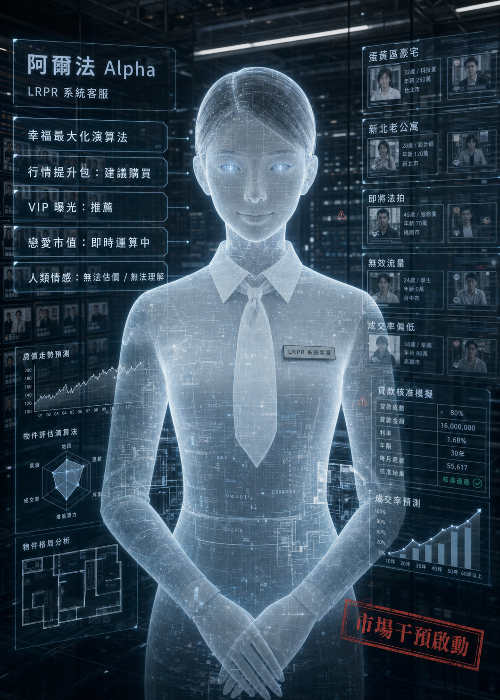

# 第 9 章〈實登：條件的透明與靈魂的隱形〉

信義區的夜雨下得肆無忌憚，彷彿連老天都在對這場資本市場的叛逃進行無情地沖刷。

林祐誠在濕滑的柏油路上狂奔，肺部像是一台風扇壞掉的老舊主機，發出呼哧呼哧的破風聲。他的身後，三輛漆著刺眼螢光藍、車身印著「市場秩序維護局（MOE）」的無聲電動廂型車，正以一種貓捉老鼠的優雅姿態勻速逼近。

這就是系統對付「一級恐怖份子」的手段——「強制清除車」。車頂上的擴音器正用字正腔圓、毫無感情的 AI 女聲廣播著：

「林祐誠先生，您的系統 ID 已被註銷。您目前屬於『無價值社會實體』，正在非法佔用高階地段的物理空間。請立即停止移動，配合本局進行『無害化回收與隔離』。重複，請勿做無效的市場抵抗……」

「去你的無害化回收！」祐誠抹了一把臉上的雨水，轉頭對著擴音器比了一個中指。

就在他準備轉彎衝進一條暗巷時，一個黑色的身影從街角的陰影處猛地撲了出來，精準地撞進了他的懷裡。

祐誠被這股衝力撞得倒退了兩步，差點摔倒在水坑裡。他定睛一看，心跳瞬間漏跳了一大拍。

許家寧。

她渾身濕透，那套造價不菲的黑色高級訂製晚禮服現在像是一塊破抹布般貼在身上。她光著腳，腳底板沾滿了信義區的泥水與碎玻璃刮出的細小血絲。她原本精緻的盤髮已經徹底散開，濕漉漉地黏在臉頰上，但她的眼睛卻亮得嚇人。

「妳……妳怎麼真的跑出來了？妳腳不痛嗎？」祐誠看著她，一時之間竟然不知道該罵她笨，還是該把她緊緊抱住。

「林祐誠，你這台破公寓，」許家寧喘著氣，一把揪住祐誠濕透的襯衫領口，惡狠狠地瞪著他，「你知不知道我為了來找你，放棄了每個月兩百萬的維修費，還把一個綠能科技執行長的香檳杯塞進他懷裡？你最好有辦法帶我離開這裡，不然我做鬼都會回來跟你討這筆『情緒管理費』！」

祐誠看著她那副狼狽卻又生機勃勃的模樣，突然笑了。在這場大雨中，在警報聲四起的街頭，他笑得像個剛中了樂透卻把彩券撕掉的瘋子。

「遵命，許副理。老公寓現在帶妳逃命。」

祐誠反手緊緊握住許家寧冰冷的手，拉著她轉身衝進了旁邊一棟商辦大樓的地下停車場車道。

清除車的藍光在車道口瘋狂閃爍，但系統設定讓它們無法進入私人產權的地下室。兩人在陰暗的地下停車場裡穿梭，直到找到了一扇通往地下街的員工通道鐵門。

「我們現在去哪？」許家寧一邊跑，一邊感覺到腳底的刺痛已經麻木。

「去貧民窟。或者說，去系統的盲區。」祐誠一腳踹開生鏽的鐵門，一股混雜著霉味與潮濕水泥的氣息撲面而來。

他們沿著黑暗的維修通道一路往下走，最終來到了一個廢棄的地下捷運連通道。這裡沒有 AR 廣告，沒有刺眼的霓虹燈，只有幾盞閃爍不定的日光燈管。

通道的盡頭，立著一台看起來像年代久遠的自動販賣機，但螢幕上沒有飲料，而是閃爍著幽綠色的復古字體：【資產降級與偷渡閘門（非官方授權）】。

「這是什麼東西？」許家寧看著這台破銅爛鐵，防備心本能地升起。

「林柏宏——就是那個被開除的系統生父告訴我的。」祐誠走到機器前，「我們現在的 GPS 定位還在系統的主網裡。市管局的無人機遲早會掃描到這裡。要徹底擺脫追捕，我們必須申請『降級簽證』，把我們的數據從高階伺服器轉移到貧民窟的離線網域。」

祐誠點擊了螢幕上的「申請簽證」。

機器發出一陣刺耳的撥接上網聲，隨後螢幕上跳出提示：【偵測到申請人：林祐誠。資產評級：負數。符合貧民窟入境標準。准許通過。】

祐誠鬆了一口氣。但當許家寧站到機器前時，螢幕卻突然閃爍起刺眼的紅光。

【警告：偵測到申請人 許家寧，身上攜帶過多高階資產憑證。】
【系統判定：您正在試圖將高階資本帶入低端市場，這將引發貧民窟的通貨膨脹。】
【您的淨值過高，不符合『社會底層』定義。請進行物理資產報廢，以平衡市場方程式。】

「物理資產報廢？什麼意思？」許家寧愣住了。

機器下方的一個金屬抽屜緩緩滑了出來，旁邊亮起一個標籤：「銷毀槽」。

螢幕上繼續顯示：【請投入等值之高階物品，直到您的『市場價值』歸零。您目前仍持有：白金信用卡三張、黑卡一張、卡地亞手錶一只。請開始銷毀。】

「這機器在敲詐嗎？！」許家寧瞪大了眼睛。身為銀行授信專員，要她親手毀掉這些象徵信用與財富的憑證，簡直比殺了她還難受。

「家寧，這就是進入底層的代價。」祐誠看著她，沒有催促。「系統不允許『有選擇的人』進入貧民窟。妳必須證明，妳是真的走投無路，是真的什麼都不要了。」

許家寧看著那幽深的銷毀槽，又回頭看了看身後漆黑的通道。她知道，只要她現在轉身，走回地面上，只要她開口認錯，她依然可以做回那個完美的「市中心挑高套房」。

但她轉過頭，看著林祐誠。看著他那頭因為淋雨而塌陷的頭髮，看著他那件廉價但溫暖的西裝外套。

她深吸了一口氣。

「啪！」

她毫不猶豫地從包包裡抽出那張代表著銀行副理身分的黑卡，雙手用力一折。堅硬的塑膠卡片發出一聲脆響，斷成兩半。她將碎片扔進了銷毀槽。

接著是白金卡、頂級俱樂部會員卡。她折斷每一張卡片時，動作都越來越快，彷彿是在砸碎那些囚禁了她七年的枷鎖。

最後，她解下手腕上那只價值不菲的卡地亞手錶，連同那副已經壞掉的 AR 隱私估價眼鏡，一起扔進了抽屜裡。

「哐當」一聲，抽屜收了回去。機器內部傳來一陣令人牙酸的粉碎聲。

【資產報廢確認。】
【系統重新估價：申請人 許家寧。當前淨值：0。社會階級：金融殘骸。】
【恭喜您，您現在一文不值。歡迎來到演算法貧民窟。請注意，本區不提供任何情緒管理費補貼與救援服務。祝您在廢墟中生活愉快。】

「噗嗤……金融殘骸。」許家寧看著螢幕上的字，突然捂著肚子，靠在牆上大笑起來。她笑得眼淚都流出來了，笑得毫無形象。

「許副理，妳現在比我這棟老公寓還慘了，妳是一片廢墟。」祐誠也笑了，他脫下自己那件半乾的西裝外套，披在許家寧瑟瑟發抖的肩膀上。

「沒關係，廢墟不用繳房貸，也不用擔心折舊。」許家寧擦了擦眼角的淚水，緊緊裹住那件帶著祐誠體溫的外套，「走吧，帶我去看看你們貧民窟的夜生活。」

穿過偷渡閘門後，他們進入了真正的「地下世界」。

這裡沒有鋪設光纖，牆壁上長滿了青苔，空氣中飄散著煮泡麵與劣質線香的味道。這裡聚集著被主流系統淘汰的邊緣人：因為付不起「情緒管理費」而破產的男人、因為年紀超過四十歲而被強制下架的女人、以及那些主動拔掉晶片，寧願當黑戶也不願被演算法控制的「數位遊民」。

他們走到了一間開在轉角的傳統便利商店。這家店的招牌燈管壞了一半，沒有自動感應門，只有一扇推起來會「嘎吱」作響的玻璃門。

祐誠用口袋裡僅剩的兩百塊零錢，買了兩盒微波咖哩飯、兩顆茶葉蛋，還有一罐熱的無糖綠茶。

他們坐在便利商店門口的塑膠椅上。沒有浪漫的燭光，沒有 AR 介面顯示對方的「心率」和「幸福指數」，只有一盞昏黃的街燈，和頭頂上偶爾傳來的一聲悶雷。

許家寧打開咖哩飯的塑膠蓋，熱氣騰騰的香料味撲鼻而來。她用塑膠湯匙挖了一大口塞進嘴裡，毫不在意形象地咀嚼著。

「好吃嗎？」祐誠一邊剝著茶葉蛋一邊問。

「這是我七年來，吃過最好吃的一頓飯。」許家寧含糊不清地說。她沒有說謊。在高級餐廳裡，每一口食物都要計算熱量、計算吃相是否符合「儀態標準」、計算這頓飯的投報率。但在這裡，咖哩飯就只是咖哩飯，它存在的唯一目的就是填飽肚子。

祐誠把剝好的茶葉蛋放進她的飯盒裡。「多吃點，『金融殘骸』需要補充蛋白質。」

許家寧看著那顆表面有著龜裂紋路的茶葉蛋，眼神變得異常溫柔。

「林祐誠。」她輕聲叫他的名字。

「嗯？」

「你昨天在半島酒店說，你不想買我，你只是想陪著我。」許家寧抬起頭，直視著他的眼睛，「在系統裡，這句話的『擔保品』不足，會被判定為無效合約。但在這裡，在我們兩個都一無所有的廢墟裡……這句話還算數嗎？」

夜風吹過，帶來一絲初夏的涼意。

沒有系統的強制配對，沒有長輩的信用對保。他們之間的條件從來沒有像此刻這樣透明過——兩個人都是社會底層的黑戶，身無分文，前途未卜。

但在這份絕對的透明中，那些原本被數據掩蓋的靈魂，終於清晰地顯露了出來。

「算數。」祐誠伸出手，輕輕幫她撥開黏在臉頰上的濕髮，指尖傳來的溫度真實而滾燙。「就算這是一份沒有期限、沒有違約金、隨時可能破產的合約，我也簽。」

許家寧笑了。不是那種經過計算的、為了提高幸福指數的假笑，而是一個徹底卸下武裝的、屬於三十三歲女人最純粹的笑容。

她低下頭，繼續吃著那盒微波咖哩飯。眼淚一滴一滴地掉進飯盒裡，但她卻覺得無比安心。不用隱藏，不用修補，因為在這個男人面前，她不需要假裝自己是一棟完美的豪宅。

然而，溫馨的時光在演算法的世界裡，總是奢侈的。

就在他們吃完最後一口咖哩飯，祐誠準備起身去丟垃圾時，便利商店門口那台原本播放著老舊綜藝節目的電視螢幕，突然發出一陣刺耳的雜訊。

畫面瞬間變成了一片死寂的純黑，中央跳出一個巨大的、緩緩旋轉的白色「α」符號。

便利商店裡的老闆嚇了一跳，試圖切換頻道，但遙控器完全失效。

接著，一個雌雄莫辨、冰冷到極點的合成語音，從電視那破舊的喇叭裡傳了出來，迴盪在空蕩的街道上：

【偵測到異常活動。】
【一級恐怖份子 林祐誠，與金融殘骸 許家寧，正在進行跨階級、零利益之無效交互行為。】
【此行為嚴重違背『人類幸福最大化演算法』，恐將導致市場價值觀崩塌。】

許家寧猛地站起身，臉色煞白地抓住祐誠的手臂。

螢幕上的「α」符號開始瘋狂閃爍紅光。

【阿爾法（Alpha）系統核心判定：該組代碼已產生不可修復之邏輯變異。】
【市場干預程序啟動。】
【針對目標 林祐誠，啟動『強制註銷與實體隔離』。】
【倒數計時：二十四小時。目標將面臨徹底的『社會性單身死亡』，其所有剩餘生存資源將被強制清算。】
【願資本與演算法，護佑台灣。】

電視螢幕「啪」的一聲黑掉，隨即恢復了綜藝節目的喧鬧聲。

祐誠看著黑掉的螢幕，又看了看自己那台已經完全失去訊號的手機。

「社會性單身死亡」——這意味著二十四小時後，他不只是一個沒有身分證的黑戶，系統甚至會剝奪他購買食物、使用公共水電、甚至走在馬路上的權利。他會變成一個連呼吸都在違法的幽靈。

資本與演算法，終究不允許兩個窮光蛋，在它的眼皮子底下免費相愛。

